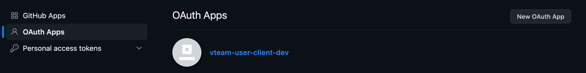
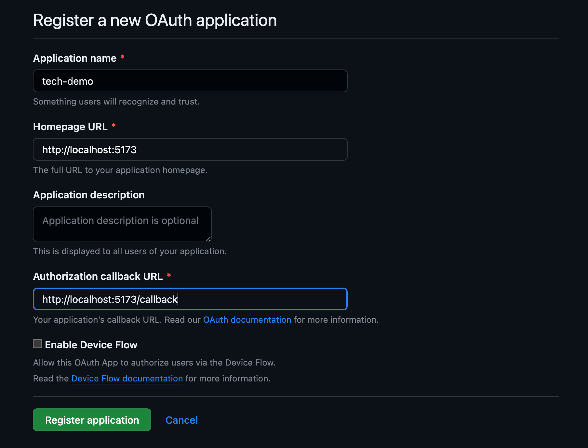
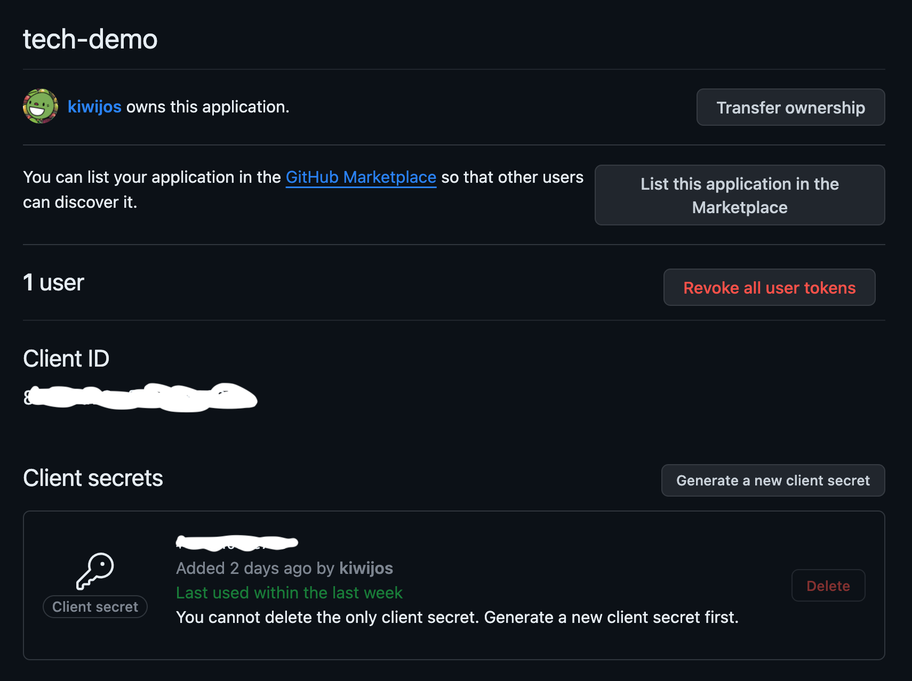
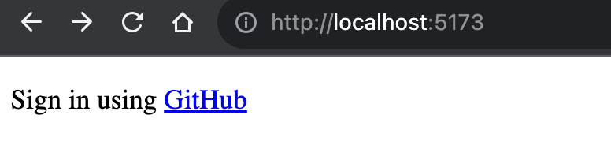
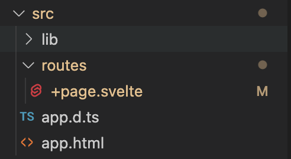
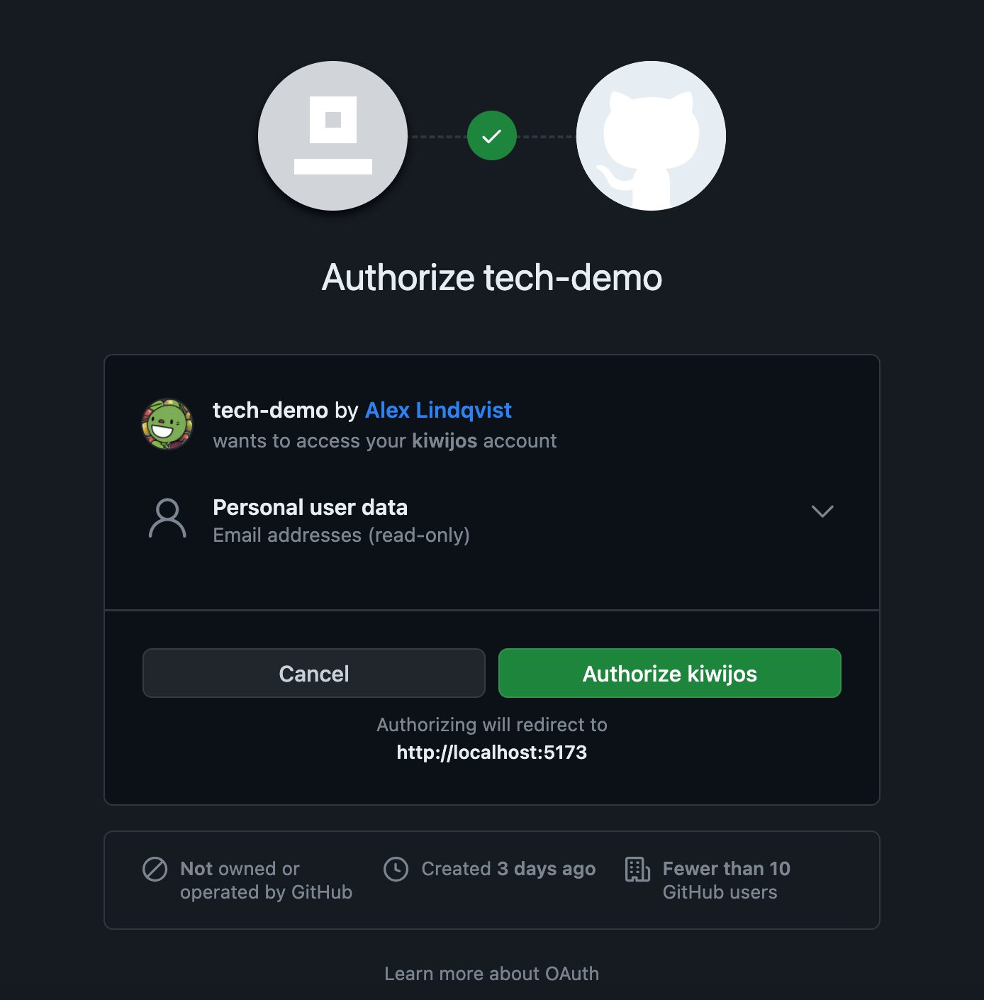
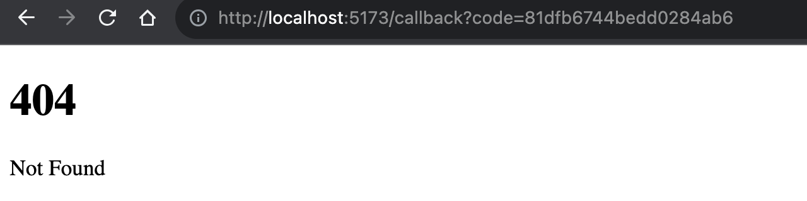
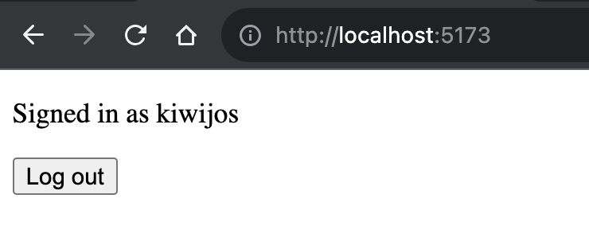

# Sign in using GitHub

## Where we're going

"Sign in using GitHub", on a button, with a link that let's users sign in to your app using GitHub. That's the goal of this tech demo. (But let's be honest, it's mostly going to be you signing in––isn't it?) With the user's permission, we will make requests on their behalf to the GitHub API and retrieve information like their name and private email addresses.

## What to expect

Do you like full code examples and lots of images? Well, this is exactly that.

I'll be doing most of the coding in SvelteKit. However, applying the same strategy to other JavaScript frameworks or no-framwork JavaScript projects or other programming languages should be straightforward. I'll even sprinkle in some more general examples using Express.js to illustrate concepts beyond SvelteKit.

Whether you're a Svelte enthusiast or not, this guide has you covered. Let's dive in!

## The general flow of autenticating using OAuth and GitHub

(I'm going to drop all pretense and simply refer to the user as _you_ from here on.)

1. After clicking the link in your app, you'll be taken to GitHub's "Authorize application" page.
2. In a dialog box there'll be an _Authorize App_ button, click it––but only if you trust yourself.
3. GitHub will take you back to your app with a temporary code.
4. You post the code back to GitHub––with some additional secret information about your app, which we'll get to later. In exchanage you get a very special user access token.
5. You can use the token to request personal user information from the GitHub API.

## Getting started

### Authenticate with an OAuth app

To sign in using GitHub you need to register your app with GitHub. There are two types of GitHub apps. "OAuth apps" and––the somewhat confusingly named––"GitHub apps".

For our purposes, using an OAuth app will be sufficient. However, if you're interested in using web hooks (a lot), dealing with organizations or scaling your app up the wazoo, you may want to use a GitHub app instead.

You can read about the differences between OAuth apps and GitHub apps [here](https://docs.github.com/en/apps/oauth-apps/building-oauth-apps/differences-between-github-apps-and-oauth-apps).

### Register your app

Registering an app––or in fact, _many_ apps––with GitHub is free and you can change the app settings whenever you want.

Navigate to the app settings page on GitHub:

1. In the top right corner, click your profile picture.
2. Go to **⚙️ Settings**.
3. In the side panel on the left, go to **<> Developer settings**.
4. Still on the left-hand side, go to **OAuth Apps**.
   
5. Click the **New OAuth App** button.

Configure the app:


1. Pick a name. Feel free to use the name I picked as inspiration.
2. Tell GitHub where your app will be served. Since the app will be in development to begin with––or indefinitely, in the case of this demo––we'll use localhost and specify a port.

> You can change the URL later when deploying the app or simply register another OAuth app with the deployment URL.

3. Remember step 3 in the General flow section? The **Callback URL** tells GitHub where to take you back to after authorizing the app. Convention dictates that you name it _callback_ or something similar, but you can call it whatever you want as long as you set it up correctly in your app.
4. Register the application.

Generate a client secret:

1. Select the app you just registered.
   
   > The client id isn't really a secret. I just got a bit carried away with the marker and ended up painting over it too.
2. Click the **Generate a new client secret** button

The client ID and client secret will be used to create access tokens. It's recomended that you store these inside your application as environment variables. That's exactly what we'll do.

## Time to get coding... almost

To follow allong with the remaining steps, I suggest you create or open up a project. Like I said in the beginning, almost any type of project will work.

### Creating a SvelteKit project

```bash
# create a new project in the current directory
npm create svelte@latest

# create a new project in my-app
npm create svelte@latest my-app
```

The `create svelte` command let's you configure the application. In the command line interface:

1. Select the Skeleton template, which means that you start with just the scafolding.

2. If you want type checking, select either TypeScript or JavaScript with JSDoc comments.

> I'll be using TypeScript. If your're writing plain JavaScript or just reading along and don't know TypeScript, don't fret! The only differences we'll encounter is using the .ts file extension instead of .js, as well as the occasional typing of functions––which you can simply omit from your code or mentally erase.

3. You won't need any additional packages if you're just following along, but having ESLint and Prettier is nice for linting and code formatting.

### Adding the environment variables

Add a .env file to the root of your project.

```yaml
PUBLIC_GITHUB_ID="<github id>"
GITHUB_SECRET="<github secret>"
```

> The **PUBLIC\_** prefix is a SvelteKit quirk. It let's us import the environment variable into client-side code.

## Signing in

### Create a root route

We'll place the link to GitHub on the front page, or in other words, the root route.



SvelteKit uses a filesystem-based router. Which means that the routes are defined by directories. To create the front page, we simply have to create a `+page.svelte` file in the root of our `routes` folder.



In a framework like Express.js, you'd do something like this instead to create the root route:

```js
app.get('/', (req, res) => {
  // here you'd handle logic and serve assets etc.
});
```

### Add the GitHub link

Now, add the code to create the GitHub link inside `+page.svelte`.

```svelte
<script lang="ts">
  import { PUBLIC_GITHUB_ID } from '$env/static/public';
</script>

<p>Sign in using
  <a href="https://github.com/login/oauth/authorize?scope=user:email&client_id={PUBLIC_GITHUB_ID}"
  >GitHub</a>
</p>
```

Let's break this down. What's most important here is the link:

- We're going to https://github.com/login/oauth/authorize and we're passing along two parameters.
- `clint_id` tells GitHub who's calling. Think of the clint id as your app, not you personally.
- But what about `scope`? The scope is about what information we want the user to grant our app access to.

In our case, we are asking for the user:email scope directly. There's a hierarchical relationship to scopes, meaning that the higher-level email scope includes the user scope.

The user scope contains things like the username and avatar image, and the email scope contains private email addresses.

### What to do with the Callback URL?

If you click the link right now, you'll be taken to the authorization page.



Here you'll see the name of your OAuth app and--if you look carefully--what personal information we want access to.

Now, it's time for that excercise in trust. Click the **Authorize application** button!



We haven't actually created the route for the `/callback` URL path yet. But, if you look in the search bar, you can see that GitHub still gave us a code. Let's do something freaky with it!

#### 1. Create the route

We need to create the route first of all. In SvelteKit, this means creating a new directory inside `routes` called `callback`.

We're not going to render a web page. Instead, we'll just handle all the logic to get the personal information. Then, we'll redirect the user back to the root route.

Because we're fetching data and need to load private environment varibales, we'll run the code on the server.

Create a `+page.server.ts` file inside the `callback` directory.

```js
// src/routes/callback/+page.server.ts

import type { PageServerLoad } from './$types';

export const load: PageServerLoad = async () => {
  // TODO: get the temporary code from the query string
};
```

The load function let's us run code before the page is rendered, much like running some logic inside the body of an Express.js route handler before serving the page.

```js
app.get('/callback', (req, res) => {
  // do some logic
  // ...
  // send some assets or redirect
});
```

#### 2. Exchange the code for an access token

Get the code. SvelteKit provides us with the parsed query string as an object.

```js
import type { PageServerLoad } from './$types';

export const load: PageServerLoad = async ({ url }) => { 
  // get the temporary code from the query string
  const code = url.searchParams.get('code');
};
```

In Express.js, you'd do something like this instead. (This is the last Express.js example.)

```js
app.get('/callback', (req, res) => {
  const code = req.query.code;
});
```

Handle errors. If you deny access to your personal information, you won't get a code. Instead the response looks something like this:


For the sake of breivety, we'll handle this by simply checking if we got the code or not. This will also handle the cases where a user enters the /callback URL path manually. But please, feel free to check the error parameter explicitly.

```js
import type { PageServerLoad } from './$types';
import { redirect } from '@sveltejs/kit';

export const load: PageServerLoad = async ({ url, fetch, cookies }) => {
  // get the temporary code from the query string
  const code = url.searchParams.get('code');

  // if no code redirect to the root route 
  if (!code || code === null) {
    throw redirect(302, '/');
  }
};
```

Load the environment variables.

```js
import type { PageServerLoad } from './$types';
import { redirect } from '@sveltejs/kit';
import { PUBLIC_GITHUB_ID } from '$env/static/public';
import { GITHUB_SECRET } from '$env/static/private';

export const load: PageServerLoad = async ({ url }) => {
  // ...
};
```

Post the code back to GitHub using fetch. Now it's time to include both the client id and client secret.

```js
// ...
// get the code and handle denied access using the code sample above
// ...

const data = {
  client_id: PUBLIC_GITHUB_ID,
  client_secret: GITHUB_SECRET,
  code: code
};

// exchange the code for a token by posting the code back to GitHub
const response = await fetch('https://github.com/login/oauth/access_token', {
  method: 'POST',
  headers: {
    'Content-Type': 'application/json',
    Accept: 'application/json'
  },
  body: JSON.stringify(data)
});
```

It's worth noting that we're sending the data in the body, and we're asking for a JSON response back.

The response should look something like this:

```json
{
  "access_token": "gho_CAAWFxgd...",
  "token_type": "bearer",
  "scope": "user:email"
}
```

We'll go ahead and extract the token.

```js
// ...
// get the response using the code sample above
// ...

const result = await response.json();

const accessToken = result.access_token;
```

To be thorough, we can check exactly what scopes the app now has access to.

```js
// ...
// get the result and access token using the code sample above
// ...

const scopes = result.scope.split(','); // if we have more than one scope
const hasEmailScope = scopes.includes('user:email') || scopes.includes('user');
```

Again for breivity, we'll handle the case where the app doesn't have access to the email scope by redireciting the user to the root route. It's possible that the app still has access to the lower-level user scope. We can use this to request email addresses too.

```js
if (hasEmailScope === false) {
  throw redirect(302, '/');
}
```

> Readers beware! Users can change the scopes after granting initial access, which means that subsequent requests to the API might fail or return different information from what you expect.

#### 3. Make authenticated requests

With the access token we can make requests to the GitHub API as the logged in user. Notice that we're including the access token in the Autorization header as a bearer token.

Firstly, let's fetch the user information.

```js
// ...
// get the access token using the code sample above
// ...

// fetch user information from the GitHub API
const userResponse = await fetch('https://api.github.com/user', {
  headers: { Authorization: `Bearer ${accessToken}` }
});

// the user data contains things like the user's name and avatar
const userData = await userResponse.json();
```

The user information looks something like this (I've omitted several fields):

```json
{
  "login": "kiwijos",
  "avatar_url": "https://avatars.githubusercontent.com/...",
  "type": "User",
  "public_repos": 10,
  "public_gists": 0,
}
```

Now, let's fetch those emails.

```js
// fetch the user's email addresses from the GitHub API
const emailResponse = await fetch('https://api.github.com/user/emails', {
  headers: { Authorization: `Bearer ${accessToken}` }
});

// the email data contains the user's email addressess and whether they are verified etc.
const emailData = await emailResponse.json();
```

The email data looks like an array (I've added \*\*\* to obscure any personal details):

```json
[
  {
    "email": "***@***.***",
    "primary": true,
    "verified": true,
    "visibility": "private"
  },
  {
    "email": "***@users.noreply.github.com",
    "primary": false,
    "verified": true,
    "visibility": null
  }
]
```

If you know what to do with this information, have at it! The rest of this tech demo is going to be about implementing persistent authentication.

---

## Keeping the user signed in

If you LOVE to sign in every time you access a web page, this section might not be for you.

We'll continue where we left things in the previous section. Starting with removing some code. We're actually going to hold off on fetching the user information until later. For now, we're happy to have the access token and will store it using cookies.

On every subsequent request to our site, we'll check the cookie, get the token and fetch the information we need. We'll pass the information along so that we can use it inside client-side code.

With the help of some conditional logic we'll switch out the GitHub link for the signed in users name. The result will look like this:



### Store the access token

We'll make use of `cookies` to create a new cookie called "session" with the access token as value. And––at last––, we'll redirect back to the root route.

```js
// src/routes/callback/+page.server.ts

// ... other imports
import { redirect } from '@sveltejs/kit';

export const load: PageServerLoad = async ({ url, cookies }) => {
  // ...
  // get the access token and check the scopes using the code sample above
  // ...

  // persist the token in a cookie
  cookies.set('session', accessToken, {
    path: '/', // send cookie with every request to this site
    httpOnly: true, // server side only cookie (i.e. not accessible via `document.cookie`)
    sameSite: 'strict', // send cookie only via requests from this site
    secure: true, // allow cookie to be sent only in secure contexts (i.e. locally or over HTTPS)
    maxAge: 60 * 60 * 24 * 30 // make cookie expire after 30 days
  });

  throw redirect(302, '/');
}
```

### Middleware to check requests

In SvelteKit, middleware is a type of hook. We'll create a new file, add a hook that runs every time there's a request and gets the access token from the cookie.

In the `src` directory, create a new file called `hooks.server.ts`.

For our purposes, we'll use a handle hook. It's a function that runs every time the server receives a request and determines the response. What we have in the code sample below is the default behaviour, it's the same as not implementing a handle hook.

```js
// src/hooks.server.ts

import type { Handle } from '@sveltejs/kit';

export const handle: Handle = async ({ event, resolve }) => resolve(event);
```

We're NOT going to implement any protected routes. But you could do it by checking the URL path and redirecting the user to another route if they don't have the correct credentials:

```js
import type { Handle } from '@sveltejs/kit';

export const handle: Handle = async ({ event, resolve }) => {
  if (event.url.pathname.startsWith('/protected')) {
    // check credentials
    // redirect if incorrect
  }

  // handle the request as normal
  return await resolve(event);
};
```

Instead, what we'll do is:

1. Get the access token.
2. Fetch the name and email addresses.
3. Add the name and primary email to the request and pass it along.

#### 1. Get the access token

If there is no access token stored in the session cookie, we'll simply pass the request along to be handled as normal.

```js
export const handle: Handle = async ({ event, resolve }) => {
  // get the token from the cookie
  const accessToken = event.cookies.get('session');

  if (!accessToken || accessToken === null) {
    // handle the request as normal
    return await resolve(event);
  } 
};
```

#### 2. Fetch the name and email addresses

This will look very familiar.

```js
// ...
// get the access token using the code sample above
// ...

// fetch the user information
const userResponse = await fetch('https://api.github.com/user', {
  headers: { Authorization: `Bearer ${accessToken}` }
});

const userData = await userResponse.json();

// fetch the user's email addresses
const emailResponse = await fetch('https://api.github.com/user/emails', {
  headers: { Authorization: `Bearer ${accessToken}` }
});

const emailData = await emailResponse.json();
```

#### 3. Add the name and primary email to the request and pass it along

To add custom data to the request, we add the data to the `event.locals` object. Here, we'll create our own object called `user` and give it a name and email field.

Notice that were're searching the emails array to find the email object with the primary field set to true, and then, getting only the email address itself.

```js
export const handle: Handle = async ({ event, resolve }) => {
  // ...
  // get access token and fetch information using the code samples above
  // ...


  // add the user to the request
  event.locals.user = {
    name: userData.login,
    email: emailData.find((email) => email.primary === true).email
  };

  return await resolve(event);
};
```

### Pass the user object into client-side code

Remember load functions? They run before a page is rendered. We'll use a load function––albeit a special type of load function––to pass the user object everywhere!

Create a new file called `+layout.server.ts` directly inside the routes folder. This is the entire contents of it:

```js
// src/routes/+layout.server.ts

import type { LayoutServerLoad } from './$types';

export const load: LayoutServerLoad = async ({ locals }) => {
  return {
    user: locals.user
  };
};
```

The thing about `+layout` files that is important to us right now is that the returned data is available to all child pages. This is why we put our `+layout.server.ts` at the root level. It means that the data will be available to _all_ pages.

### Update the page

Go back to the `+page.svelte` file we created at the beginning (i.e. the root route). The user object will be accessible via the page store.

```svelte
<script lang="ts">
  import { PUBLIC_GITHUB_ID } from '$env/static/public';
  import { page } from '$app/stores';
</script>

{#if $page.data.user}
  <p>Signed in as {$page.data.user.name}</p>
  <form action="/logout" method="POST">
    <button type="submit">Log out</button>
  </form>
{:else}
  <p>Sign in using
    <a href="https://github.com/login/oauth/authorize?scope=user:email&client_id={PUBLIC_GITHUB_ID}"
    >GitHub</a>
  </p>
{/if}
```

I'll leave it up to you to implement the logout logic for now. If you wan't you can have a look at the code inside this repo for a simple solution using Actions.

## Final notes

There are still a few things that we haven't gotten around too. For instance, we're not handling the case where the user revokes access to their information after they signed in.

But hopefully, you can now sign into your app using GitHub.
